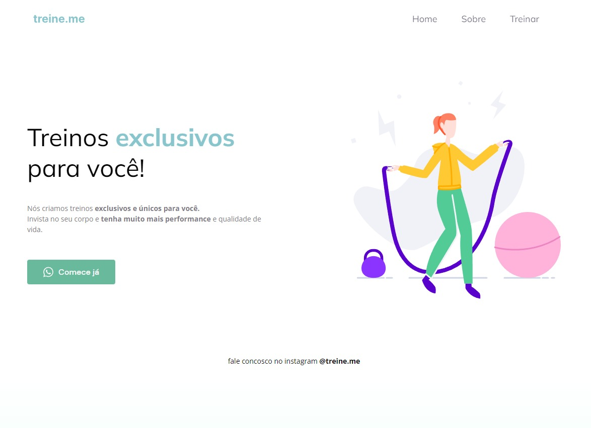

A simple development of a company ad.

  <a href="#-technologies">Technologies</a>&nbsp;&nbsp;&nbsp;|&nbsp;&nbsp;&nbsp;
  <a href="#-project">Project</a>&nbsp;&nbsp;&nbsp;|&nbsp;&nbsp;&nbsp;
  <a href="#-site">Site</a>&nbsp;&nbsp;&nbsp;|&nbsp;&nbsp;&nbsp;
  <a href="#memo-license">License</a>

  

 

  

## 💻 Technologies

This project was developed with the following technologies:

- HTML and CSS
- Figma
- Git and Github

## 🌐 Site

You can check the project with this link: https://company-ad-explorer.vercel.app

## :memo: License

This project is under the MIT license.

---

Check my others projects!👋
